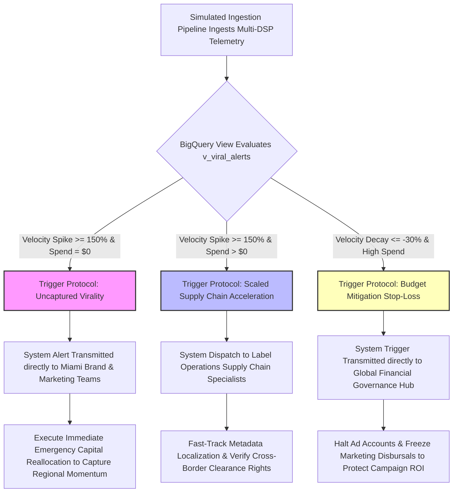

```mermaid
graph TD
    A[Simulated Ingestion Pipeline Ingests Multi-DSP Telemetry] --> B{BigQuery View Evaluates v_viral_alerts}
    
    B -->|Velocity Spike >= 150% & Spend = $0| C[Trigger Protocol: Uncaptured Virality]
    B -->|Velocity Spike >= 150% & Spend > $0| D[Trigger Protocol: Scaled Supply Chain Acceleration]
    B -->|Velocity Decay <= -30% & High Spend| E[Trigger Protocol: Budget Mitigation Stop-Loss]
    
    C --> C1[System Alert Transmitted directly to Miami Brand & Marketing Teams]
    C1 --> C2[Execute Immediate Emergency Capital Reallocation to Capture Regional Momentum]
    
    D --> D1[System Dispatch to Label Operations Supply Chain Specialists]
    D1 --> D2[Fast-Track Metadata Localization & Verify Cross-Border Clearance Rights]
    
    E --> E1[System Trigger Transmitted directly to Global Financial Governance Hub]
    E1 --> E2[Halt Ad Accounts & Freeze Marketing Disbursals to Protect Campaign ROI]
    
    style C fill:#f9f,stroke:#333,stroke-width:2px
    style D fill:#bbf,stroke:#333,stroke-width:2px
    style E fill:#ffb,stroke:#333,stroke-width:2px
```
